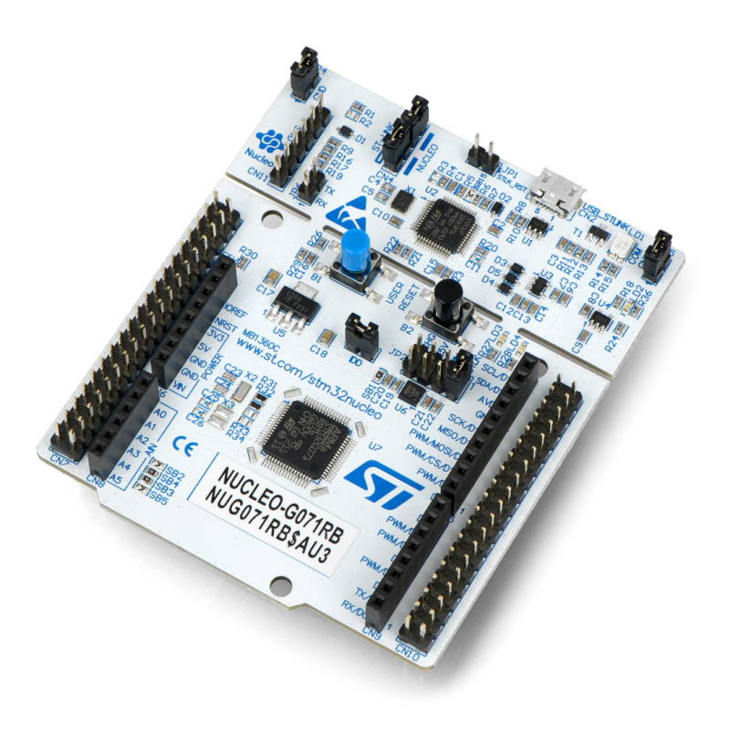
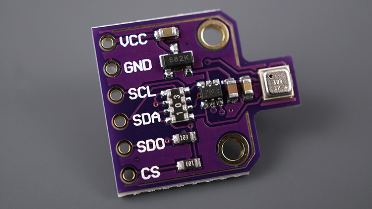

# Embedded Smart Systems SoSe 2025

**Course**: 253 Embedded Smart Systems (Summer Semester 2025)
**University**: Nordhausen University of Applied Sciences
**Program**: M.Eng. Computer Engineering for IoT Systems

## Table of Contents

* [Project Overview](#project-overview)
* [Hardware Components](#hardware-components)
* [Software Architecture](#software-architecture)
* [Installation & Setup](#installation--setup)
* [Usage Instructions](#usage-instructions)
* [Demo Video](#demo-video)
* [Team](#team)
* [License](#license)

## Project Overview

This project involves designing and implementing a NUCLEO-G071RB-based IoT prototype. The device reads environmental data (temperature, pressure, humidity) from a **BME680** sensor over I2C, communicates using a **SX1262 LoRa module** over SPI, and responds to commands received from a PC via UART. It showcases core embedded system concepts including peripheral interfacing, command-based control, and long-range communication.

The firmware enables:

* Reading environmental parameters (`temp`, `humi`, `press`)
* Executing basic arithmetic operations (`add`, `sub`, `mul`, `div`)
* Sending LoRa messages on startup **and via terminal command**
* Displaying a command menu to guide users


## Hardware Components

### 1. NUCLEO-G071RB Board

ARM Cortex-M0+ based STM32 development board with integrated ST-LINK debugger, Arduino-compatible headers, and USB support.



### 2. BME680 Environmental Sensor

I2C-based sensor capable of measuring temperature, pressure, humidity, and VOC. Utilized here for temperature, humidity, and pressure readings.



### 3. SX1262 LoRa Radio Module (HAT)

Long-range, low-power wireless transceiver module communicating over SPI. Sends "Hello World" at boot and can be extended for more.


### 4. USB-UART Communication Interface

Used to issue commands and receive responses from the microcontroller.

## Software Architecture

The firmware was developed using STM32CubeIDE and STM32 HAL libraries. The design follows a superloop structure with UART-driven command parsing. It initializes and manages I2C (for BME680), SPI (for LoRa), and UART (for terminal interface).

**Main Functional Blocks:**

* **Peripheral Initialization:** Configures I2C, SPI, GPIO, UART
* **Command Parsing Engine:** Interprets terminal input
* **Sensor Reading Handlers:** Polls BME680 for values
* **Math Operations:** Executes integer arithmetic
* **LoRa Integration:**
  - Sends test message ("Hello World") at startup
  - Supports dynamic messages via `lora <text>` command
  - Confirms transmission with UART output


## Installation & Setup

1. **Clone Repository:**

```bash
git clone https://github.com/Mukundkhunt/hsn-253-project.git
```

2. **Open Project:**
   Import the folder in STM32CubeIDE. Ensure the STM32G071RB board and required drivers are installed.

3. **Wiring:**

* **BME680:** Connect to SDA/SCL with power lines
* **LoRa HAT:** Mount on Arduino header
* **UART:** Connect USB cable for COM port

4. **Build & Flash:**
   Compile and flash the firmware to the NUCLEO board using CubeIDE.

5. **Launch Serial Terminal:**
   Use PuTTY, TeraTerm or Minicom with 115200 baud, 8-N-1 settings. Reset the board if needed.

## Usage Instructions

* **help** – Display available commands
* **10 temp** – Read temperature for 10 seconds
* **add 3 5 2** – Returns `Result: 10`
* **div 100 5** – Returns `Result: 20`
* **lora Hello World** – Sends "Hello World" over LoRa

On reset, a "Hello World" LoRa message is sent automatically.
You can now send custom LoRa messages using the `lora` command.

## Demo Video

<video src="test/test_terminal.mov" controls width="600">Your browser does not support the video tag. You can download the video file to view it.</video>

## Team

* **Mukundkumar G. Khunt**
* **Gudduru Keerthi**
* **Kahagalage Ravindu Lakshan**
* **Ritvik Bahirwar**
* **Pavan Kumar Reddy Gudla**

## License

This project is licensed under the MIT License. See the [LICENSE](https://github.com/Mukundkhunt/hsn-253-project/blob/main/LICENSE) file for details.

